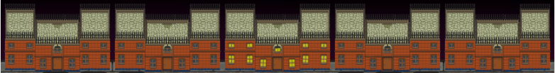

# 'Pupper'

## Introduction

I was tasked to build a grid based game for module 1 'Front End Development' at General Assembly. Pupper is a fun take on the 1981 arcade game Frogger. I had a lot of fun making this game and I'm sure you will have a lot of fun playing it. Please do so [here](https://jompra.github.io/sei-project-one/).

## Contents
* [Introduction](##Introduction)
* [Contents](##Contents)
* [Project Brief](##Project-Brief)
* [Technologies](##Technologies)
* [Grid Design](##Initial-design-and-Wireframes)
* [Game Mechanics](#Game-Mechanics)
  * [Sprite Movement](##Sprite-Movement)
  * [Zombies](##Zombie-Generation-and-Movement)
  * [Trains](##Train-Generation-and-Movement)
  * [Detecting Colissions](##Detecting-Colissions)
  * [Losing the game](##Loss-Logic)
  * [Getting Home](##Getting-Home)
  * [Scoring and losing lives](##Score-and-lives)
  * [Losing](##Loss-Logic)
  * [Winning](##Win-Logic)
* [Wins and Blockers](##Wins-and-Blockers)
* [In Conclusion](##in-conclusion)

## Project Brief

The idea of Frogger is to guide a family of frogs across a road, and a river to their homes at the top of the screen.

To make things more challenging there are numerous moving obstacles that the frogs must avoid to reach their destination.

* Create a grid based game suitable for desktop browsers.
* Design a way for players to win or lose the game and feed this back.
* Use HTML, CSS, and Vanilla Javascript.
* The game should be playable for one player.
* The obstacles should be auto generated.
* Deploy the game online for the world to enjoy.

## Technologies
* HTML5
* CSS3
* Javascript ES6
* Git

## Grid Design

I started with a grid of divs as this would allow me to accurately place the sprite and obsticals on the game board. I decided to use this method over using a canvas so that I could practice using 2D arrays.

Using a 2D array as opposed to a single array felt like alogical approach for two reasons. Firstly by making each row it's own array this gives me a good way of manipulating the user's sprite X and Y position where the first cells index becomes the Y position and the second becomes the X position. The second reason is because as the obsticals move horizontally in their rows and do not move vertically, using a 2D array maent it was easier to keep track of exactly which obsticals were assigned to each row.

Using the 2D array did mean that my code became somewhat more difficult to read but all in all this still feels like the best approach.

# Game Mechanics

## Sprite Movement

This is acheived simply by taking the user's keystroke (↑, ↓, →, ←) removing the .sprite class and background image from the sprite's current position, updating the x or y values and then re-drawing the background image at the new values. A different background is drawn depending on which direction the user has chosen.

## Zombie Generation and Movement
I wanted an easy way of adding and removing the zombie elements so that I could test the gameplay and easily change position and quantity. The easiest way to do this was with another 2D array containing each zombie's start x and y values. The zombies are initialised once every second and have their x value increased or decreased depending on whether they have odd or even y values. The image is drawn and deleted in the same way as the sprite described above.

I decided to randomise the zombie sprites to add variety to each game. At page load, a random integer is pushed to each array in initZombies. This third integer is used to build the filepath to a corresponding zombie sprite.

## Train Generation and Movement
The trains are also initialized in a 2D array and advance in the same way that the zombies do. An odd ~~bug~~ feature of the train array is that odd numbered rows need to have their x values entered in ascending order and even rows descending. This is because the advance function will place all of the divs on top of eachother if initialised incorrectly.

## Detecting Colissions
This is a fairly simple process of checking whether the user's sprite's x and y position corresponds with a cell that contains .zombie, or if it does not contain .train when above row index 7. if either of these conditions are met then the user's sprite re-initilaises to the start position and one life is decremented.

## Getting Home
Once the user's Sprite reaches the grid divs that are behind the houses, the houses at specified indexes redraw to imitate lights on. A variable is also incremented to track the number of houses occupied.

## Score and Lives
When the user sprite moves forward it's furthest jump is recorded. When this happens, this increments the score by 10. When the user gets a sprite home this increments the score by 50 points. This keeps the scoring system close to the original game.

## Loss Logic
Every time the user sprite is initialised, the program checks to see if the user has more than 0 lives, if not the user has lost. Once this happens, all timers advancing the obstacles stop and the user is presented with a game lost graphic, and the option to restart the game.

## Win Logic
At sprite initialization the number of occupied houses is checked. If this is equal to 5 then all timers stop and a win graphic is displayed to the user.

## Wins and Blockers
#### Wins include:
* Randomising the zombie sprites
  * I experimented with the efficiency of using Math.random() in a for loop mulitple times using performance.now(). I tried generating a long random number, splitting it into an array and then iterating over this to push it to the zombie arrays. I found however that the options only had a performance difference of 0.003ms. Although the second option was quicker it offered less flexibility and was less readable.

#### Further learning:
* I struggled to get the user's sprite to display on top of a train sprite. Trying to get this to work unfortunately swallowed a lot of time. I have found a workaround that at it's minimum is aesthetically acceptable however is not perfect. In future I would ensure that blockers like this do not take time away from other necessary features.
* Resetting the game without refreshing the page was a blocker for me and is still buggy.

## Additional features
* More Levels
* Turn Based Two Player
* Simultanious Two Player
* Bonuses such as a bone and companion (Fly and lady frog in original game)

## In Conclusion
All in all this was a fun project with plenty of creative scope, I'm pleased with the styling and think that I have the basis of a fun and playable game. I'm disappointed that I wasn't able to add the additional features mentioned above but I feel that this was down to my time management of the blockers.